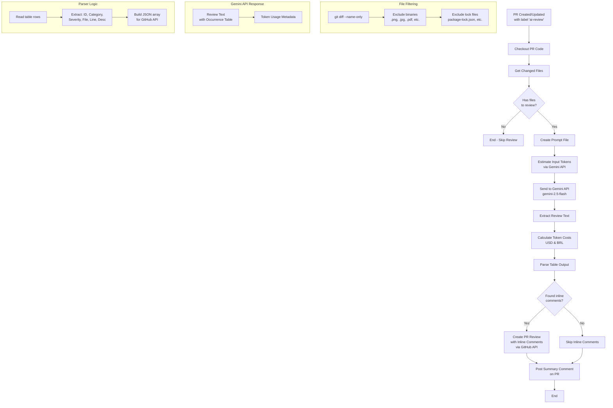

# Gemini Code Review Workflow

## Fluxo Principal



## Steps do Workflow

| Step | Nome | Descrição |
|------|------|-----------|
| 1 | Checkout PR code | Clona o repositório com histórico completo |
| 2 | Get changed files and diff | Lista arquivos alterados, excluindo binários e lock files |
| 3 | Create prompt file | Cria arquivo com prompt de code review |
| 4 | Estimate input tokens | Conta tokens antes de enviar (opcional) |
| 5 | Send to Gemini API | Envia código + prompt para Gemini 2.5 Flash |
| 6 | Parse table and create inline comments | Extrai dados da tabela e cria comentários inline |
| 7 | Comment on PR | Posta review completo + custos no PR |

## Estrutura de Saída do Gemini

```
| ID | Category | Severity | File | Approx. line | Short description |
|----|----------|----------|------|--------------|-------------------|
| 1  | Functional.Logic | Block | src/app.js | 42 | Missing null check |

---
Detalhes do Finding #1:
- Category: Functional.Logic
- Severity: Block
- File: src/app.js
- Approx. line: 42
- Description: [Functional.Logic] Missing null check before accessing property
- Suggestion: Add null/undefined check

---
Final summary:
- PR risk: Medium
- Main defect categories found: Functional.Logic
- Blocking items: #1
```

## Custos (Gemini 2.5 Flash)

| Tipo | Preço por 1M tokens (USD) |
|------|---------------------------|
| Input | $0.15 |
| Thinking | $3.50 |
| Output | $0.60 |
